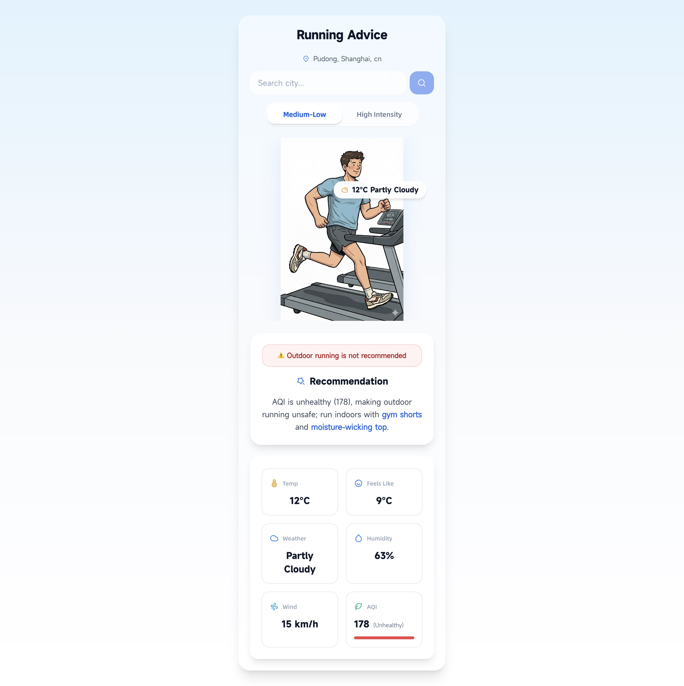

# RunWear - Smart Running Clothing Suggestions

A web application that provides personalized running clothing recommendations based on weather conditions and air quality. Built with Next.js and powered by AI for intelligent suggestions.



## Features

- 🎨 Prominent character image display at the top with instant tab switching
- 🌍 City name display with reverse geocoding support
- 🌤️ Real-time weather data (temperature, humidity, wind speed, feels-like temperature, weather conditions)
- 🌬️ Air quality index with numeric value and color-coded indicator
- 🏃 Two running intensity levels (Low-Medium Zone 1-3, High Zone 4-5)
- ⚡ Optimized single API call for both intensity suggestions (reduces LLM usage by 50%)
- 🤖 AI-powered clothing suggestions using OpenRouter LLM with intelligent outdoor/indoor decision
- 📱 Responsive design for both desktop and mobile devices
- ⚠️ Safety warnings for unsafe outdoor conditions (AQI ≥ 150, extreme weather, dangerous temperatures)
- 🔍 City search functionality with autocomplete
- 🛡️ Robust error handling with fallback to rule-based suggestions when LLM is unavailable
- 📊 Detailed error logging for debugging LLM API issues

## Tech Stack

- **Next.js 14** - React framework
- **TypeScript** - Type safety
- **OpenRouter API** - AI-powered suggestions with intelligent category determination
- **Open-Meteo API** - Weather and air quality data (100% free, no API key)
- **Nominatim (OpenStreetMap)** - City name reverse geocoding with Open-Meteo fallback

## AI Tools Used

This project was built with the assistance of modern AI tools:

- **[Lovart](https://www.lovart.ai)** - UI/UX design and visual styling
- **Nano Banana Pro** - Character image generation
- **OpenCode (Vibe Coding)** - Development assistance and code implementation
- **GLM-4.7** - LLM model for AI-powered reasoning and suggestions

## Getting Started

### Prerequisites

- Node.js 18+ installed
- OpenRouter API key (free at https://openrouter.ai/)

### Installation

1. Clone the repository and install dependencies:

```bash
npm install
```

2. Copy the example environment file and add your API key:

```bash
cp .env.example .env.local
```

3. Update `.env.local` with your actual API key:

```
OPENROUTER_API_KEY=your_actual_openrouter_api_key_here
OPENROUTER_API_URL=https://openrouter.ai/api/v1/chat/completions
OPENROUTER_MODEL=meta-llama/llama-3.1-8b-instruct:free
```

Note: Weather data uses Open-Meteo API which is completely free and requires no API key.

You can change the LLM model by setting `OPENROUTER_MODEL` to any model available on OpenRouter (e.g., `openai/gpt-4o-mini`, `anthropic/claude-3-haiku`, etc.).

4. Run the development server:

```bash
npm run dev
```

5. Open [http://localhost:3000](http://localhost:3000) in your browser.

## Project Structure

```
RunWear/
├── app/
│   ├── api/
│   │   ├── weather/
│   │   │   ├── route.ts        # Weather & AQI data endpoint
│   │   │   └── search/
│   │   │       └── route.ts    # City search endpoint
│   │   └── suggestion/
│   │       └── route.ts        # AI-powered suggestion endpoint (supports dual requests)
│   ├── layout.tsx              # Root layout
│   ├── page.tsx                # Main page component
│   └── globals.css             # Global styles
├── components/
│   ├── CharacterImage.tsx      # Character image display based on category
│   ├── IntensitySelector.tsx   # Running intensity selector
│   ├── SuggestionDisplay.tsx    # Clothing suggestion display
│   └── WeatherDisplay.tsx      # Weather information display with AQI indicator
├── public/
│   └── images/                 # Add your character images here
└── ... config files
```

## Adding Character Images

The application expects character images for different clothing categories:

- `winter_cold.png` - Cold weather outfit
- `winter_mild.png` - Cool weather outfit
- `spring_fall.png` - Mild weather outfit
- `summer_warm.png` - Warm weather outfit
- `summer_hot.png` - Hot weather outfit
- `gym.png` - Indoor running outfit

Place your images in the `public/images/` directory. Recommended size: 600x800px.

## Clothing Categories

The AI determines the most appropriate clothing category based on weather conditions and running intensity:

### Outdoor Running (5 categories)

1. **Winter Cold** - Very cold temperatures (≤5°C adjusted)
2. **Winter Mild** - Cool temperatures (6-12°C adjusted)
3. **Spring/Fall** - Mild temperatures (13-20°C adjusted)
4. **Summer Warm** - Warm temperatures (21-27°C adjusted)
5. **Summer Hot** - Hot temperatures (>27°C adjusted)

**Temperature Adjustment:** For high-intensity runs, the temperature is adjusted by +5°C to account for increased body heat generation.

### Indoor Running (1 category)

6. **Gym/Indoor** - Unsafe outdoor conditions (recommend treadmill/gym):
   - Air Quality Index (AQI) ≥ 150 (Unhealthy)
   - Extreme cold (temperature or feels-like < -20°C)
   - Extreme heat (temperature or feels-like > 35°C)
   - Extreme wind (wind speed > 50 km/h)
   - Severe weather (rain, snow, thunderstorms, etc.)

**Note:** The AI intelligently determines whether outdoor running is safe based on ALL weather factors, not just individual thresholds. When conditions are unsafe, it automatically recommends indoor running instead.

## Deployment to Vercel

1. Push your code to GitHub/GitLab/Bitbucket

2. Go to [Vercel](https://vercel.com) and import your repository

3. Add environment variables in Vercel dashboard:
   - `OPENROUTER_API_KEY`
   - `OPENROUTER_API_URL` (optional, defaults to OpenRouter)

4. Deploy!

The application will be automatically deployed with every push to your main branch.

## Environment Variables

| Variable | Description | Required | Default |
|----------|-------------|----------|---------|
| `OPENROUTER_API_KEY` | Your OpenRouter API key | Yes | - |
| `OPENROUTER_API_URL` | OpenRouter API URL | No | https://openrouter.ai/api/v1/chat/completions |
| `OPENROUTER_MODEL` | OpenRouter model to use | No | meta-llama/llama-3.1-8b-instruct:free |

**Note:** Weather API (Open-Meteo) is completely free and requires no configuration.

**Available Models:** You can use any model from [OpenRouter's model list](https://openrouter.ai/models). Popular options include:

**Free Models:**
- `meta-llama/llama-3.1-8b-instruct:free` (default)
- `google/gemma-2-9b-it:free`
- `qwen/qwen-2.5-7b-instruct:free`
- `microsoft/phi-3-mini-128k-instruct:free`

**Paid Models:**
- `openai/gpt-4o-mini`
- `anthropic/claude-3-haiku`
- `openai/gpt-4o`

## API Endpoints

### GET /api/weather
Fetches weather and air quality data based on latitude and longitude.

Query Parameters:
- `lat` - Latitude
- `lon` - Longitude
- `city` - City name (optional, for geocoding)

Returns:
- Location name (city, state, country)
- Temperature (°C)
- Feels-like temperature (°C)
- Humidity (%)
- Wind speed (km/h)
- Weather condition and code
- Air Quality Index (AQI)

### GET /api/weather/search
Searches for cities by name with autocomplete.

Query Parameters:
- `city` - City name to search

Returns:
- Array of city results with name, admin1, country, country_code, latitude, longitude

### POST /api/suggestion
Generates AI-powered clothing suggestions for one or both intensity levels.

Request Body:
- `temperature` - Current temperature (°C)
- `humidity` - Humidity percentage
- `windSpeed` - Wind speed (km/h)
- `feelsLike` - Feels-like temperature (°C)
- `aqi` - Air quality index
- `weatherCode` - Weather condition code (WMO code)
- `intensity` - Running intensity: 'low', 'high', or 'both'

**Optimization:** Use `intensity: 'both'` to fetch both intensity suggestions in a single API call, reducing LLM usage by 50%.

## AI Decision Logic

The OpenRouter LLM makes intelligent decisions about:

1. **Category Selection:** Evaluates all weather factors (temperature, humidity, wind, AQI, weather conditions) to determine the most appropriate clothing category.

2. **Outdoor Safety:** Analyzes whether outdoor running is safe by considering:
   - Air quality (AQI ≥ 150 indicates unhealthy conditions)
   - Extreme temperatures (< -20°C or > 35°C feels-like)
   - High wind speeds (> 50 km/h)
   - Severe weather (rain, snow, thunderstorms, etc.)

3. **Intensity Adaptation:** Adjusts temperature recommendations based on running intensity:
   - Low-Medium (Zone 1-3): Uses feels-like temperature as-is
   - High (Zone 4-5): Adds +5°C to account for body heat generation

**Fallback:** If LLM API fails, the application uses rule-based categorization with the same temperature thresholds, ensuring reliable suggestions even without AI.

## License

MIT

## Contributing

Contributions are welcome! Please feel free to submit a Pull Request.
